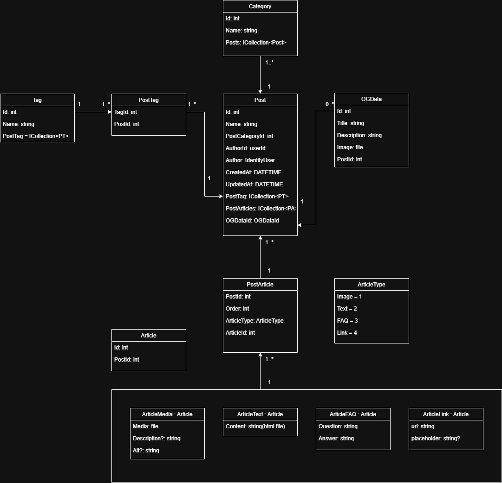

# Web ke hře PixelDread

## Tato maturitní práce se zaměřuje na vývoj webové aplikace s proprietárním redakčním systémem pro mobilní hru PixelDread. Web zahrnuje následující klíčové funkce:

- Blog
- Seznam aktualizací
- Přihlašovací systém
- Rozhraní pro správu obsahu
- Stránku s ochranou osobních údajů
- FAQ (Často kladené otázky)

## Prostředky
- Frontend: React, TypeScript
- Backend: ASP.NET Core
- Design: Figma
- Deployment: Docker
- Hosting: VPS

